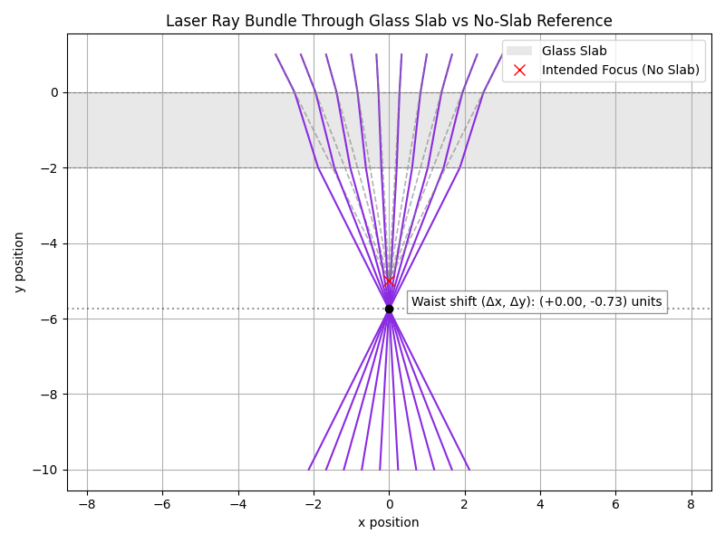

# C++ Ray-Based Laser Simulation

This project simulates the propagation of a laser beam through a glass slab using geometric optics. It models ray refraction, calculates waist position shifts, and visualizes beam paths in 2D. Originally developed to study defocus introduced by optical elements such as viewports and as a beginner project for self-led C++ learning.

## Features

- **Geometric ray tracing** through planar dielectric surfaces
- **Numerical intersection solving** for arbitrary angles
- **Waist position calculation** to estimate beam defocus
- **Overlayed visualization** of:
  - Refracted rays (with glass slab)
  - Original rays (without glass slab)
- **Output plotting** with ray paths, waist shift annotation, and beam overlays

## Output Example

## Todo

The scientific goal of this project is to calculate the waist position of a converging laser pulse when it is focused through a glass viewport at an angle. Maybe also estimate the amount of abberation introduced as well.
It would be great to have an interactive gui built in C++

## Author
Andrew Sutherland
Heavily relied on https://cplusplus.com/doc/tutorial/ and chatgpt
