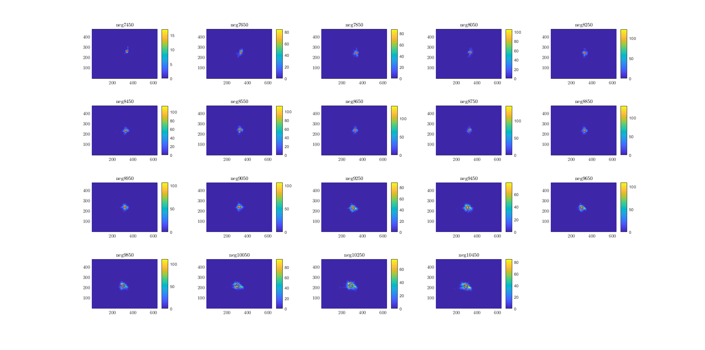
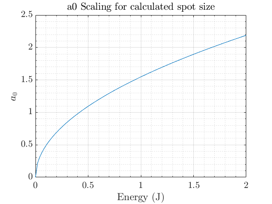

# Focus Scan

## Description
Use the matlab reader to quickly analyse a focus scan performed with the Focus Diagnostic camera and saved onto the local nas.
The motor stage drives a microscope objective that scans throught the focus of a f=2m parabola.
Main usage is for assesing spot quality, identifying focusing errors, and quickly estimating on-target intensity (a0).

## Usage
The only input required is the path to the directory of the focus scan tiffs.
The motor position should be written in the filename e.g. "neg9050", "pos695". Background files should be named "bg" or "background".

The script will find the 1/e^2 spot size of the images, calculate the mean and standard error within one step of the motor, plot the x and y components and fit a Gaussian profile waist curve to the data. The minimum spot size and the respective position of the motor will be displayed on the graph. Using the minimum spot size, the peak intensity and a0 can be calcuted for a range of laser energy.

Below are example plots generated by
### Single sample of intensity profile, cleaned, first and second moments overlaid

### Regression fitting to find minimum waist location in x and y planes

### Scaling of normalised laser amplitude

## Authors and acknowledgment
Andrew Sutherland
Contributions welcome

## Project status
Ongoing
